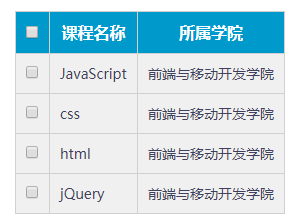
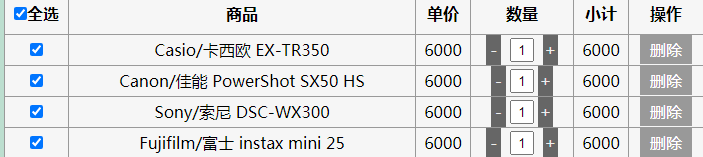

# 每日作业-jQuery第02天

### 1 - 全选案例（加强训练）

- 题目描述

   全选案例，模拟品优购购物车模块中的全选需求：

   1）点击上面的全选，下面全部选中。

   2）下面的input如果全部选中，上面的input同步选中。

- 训练目标

  学会使用 jQuery 的属性操作，重点测试 prop() 操作属性。

- 训练提示

  1.分别获取上面和下面的input

  2.如果上面的选中下面的全选中

  3.如果下面的选中个数为4个上面的同步选中

- 

###    2 - 切换盒子背景色（综合练习）

- 题目描述

  点击添加能够添加选项，点击删除能够删除选项。

  

- 训练目标

  训练元素的创建，添加，删除

- 训练提示

  1.创建指定内容的元素

  2.讲元素添加到指定位置

  3.删除指定元素

