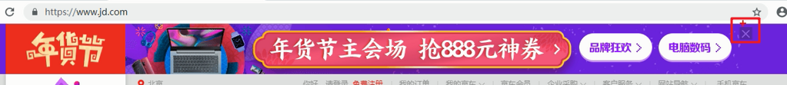
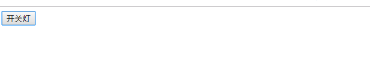

# 每日作业-Web APIs第1天

###    1 - 京东关闭广告（直接隐藏即可）（加强训练）

- 题目描述

  仿京东网，单击关闭广告，具体表现如下图：

  

- 训练目标

  能够操作元素的样式属性

- 训练提示

  1.获取要操作的关闭按钮和广告元素

  2.关闭按钮注册单击事件

  3.隐藏广告元素

- 

### 2 - 网页开关灯（加强训练）

- 题目描述

  单击按钮，控制网页开关灯，具体表现如下图：

  

- 训练目标

  能够操作元素的样式属性

- 训练提示

  1.获取要操作的按钮和body元素

  2.给按钮注册单击事件

  3.使用全局变量记录灯的状态

  4.根据灯的状态，控制body元素的背景色，实现开关灯效果